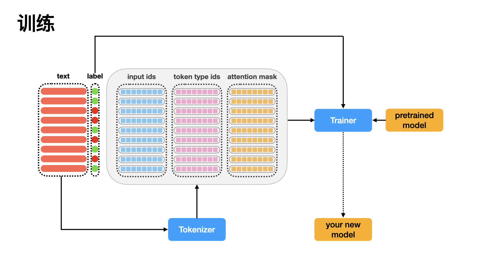
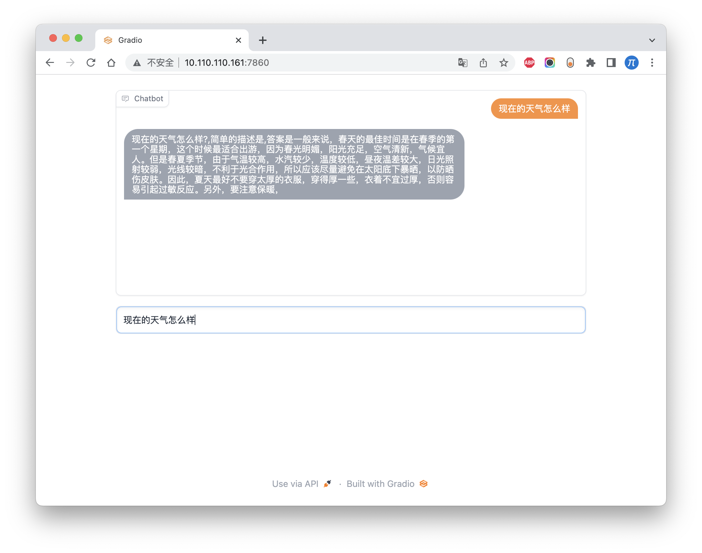
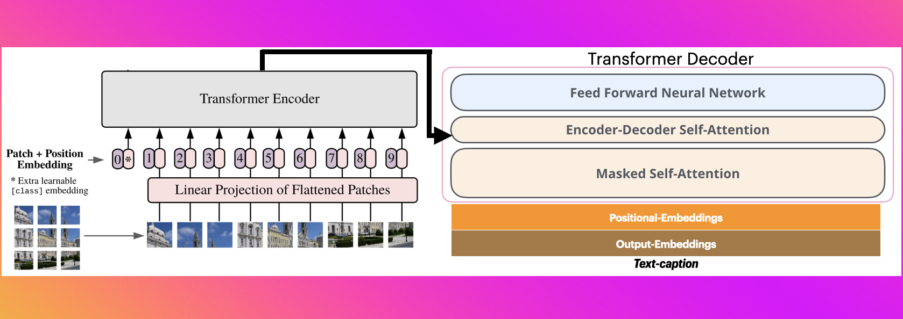
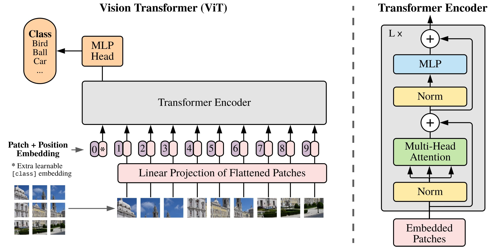

# zero to nlp

## 特点

1. 注重中文的nlp建设
2. 基于transformers库
3. 每一个项目，都具有数据、模型训练、部署等模块
4. 提供公开的数据
5. 开箱即用，保证代码都是可跑通，替换数据即可训练出自己的模型
6. transformers库的源码级介绍
7. 基于pytorch，不用tensorflow
8. 模型方面，只介绍大模型，不再介绍传统文本模型
9. 每一个项目，都会给出相关的坑和注意事项

## 目录

[//]: # (### 源码解读)

[//]: # ()

[//]: # (当前`transformers`包，确实好用，包括训练等，但是我们不能停留于表面，不能浅尝辄止。要深入源码底部，挖掘出每一个细节。因此，在这个模块中，我将把)

[//]: # (`transfrmers`包中用到的python高级用法、优秀的数据处理思路和方法，尽可能的讲解清楚。)

[//]: # ()

[//]: # (⚠️将逐步完善，敬请期待)

[//]: # (| 模块         | 文件名称 | 作用  | 实现细节 |)

[//]: # (|------------|------|-----|------|)

[//]: # (| Tokenizer  | ☑️   | ☑️  | ☑️   |)

[//]: # (| Datasets   | ☑️   | ☑️  | ☑️   |)

[//]: # (| Model      | ☑️   | ☑️  | ☑️   |)

[//]: # (| Trainer    | ☑️   | ☑️  | ☑️   |)

[//]: # (| AutoClass  | ☑️   | ☑️  | ☑️   |)

[//]: # (| AutoConfig | ☑️   | ☑️  | ☑️   |)

### 模型训练

| 中文名称     | 文件夹名称                                                                                                                 | 数据  | 数据清洗 | 大模型 | 模型部署 | 图解  |
|----------|-----------------------------------------------------------------------------------------------------------------------|-----|------|-----|------|-----|
| 中文文本分类   | [chinese_classifier](https://github.com/yuanzhoulvpi2017/zero_nlp/tree/main/chinese_classifier)                       | ✅   | ✅    | ✅   | ☑️   | ✅   |
| 中文gpt2   | [chinese_gpt2](https://github.com/yuanzhoulvpi2017/zero_nlp/tree/main/chinese_gpt2)                                   | ✅   | ✅    | ✅   | ✅    | ☑️  |
| 中文clip   | [chinese_clip](https://github.com/yuanzhoulvpi2017/zero_nlp/tree/main/chinese_clip)                                   | ✅   | ✅    | ✅   | ☑️   | ✅   |
| 图像生成中文文本 | [VisionEncoderDecoderModel](https://github.com/yuanzhoulvpi2017/zero_nlp/tree/main/vit-gpt2-image-chinese-captioning) | ✅   | ✅    | ✅   | ☑️   | ✅   |
| vit核心源码介绍 | [vit model](https://github.com/yuanzhoulvpi2017/zero_nlp/tree/main/vit)                                               | ☑️  | ☑️   | ☑️  | ☑️   | ✅   |
| 训练ThuGlm | [train_thuglm](https://github.com/yuanzhoulvpi2017/zero_nlp/tree/main/train_thuglm)                                   | ✅   | ✅    | ✅   | ☑️   | ☑️  |

## 数据流程图解

我一直觉得，数据流程通过图解的形式表达出来，其实是最清楚的，因此我都会尽可能的把每一个任务的都图解出来。

### 文本分类数据图解

### 中文gpt2

### 中文clip

### 图像生成中文文本

### vit 源码

