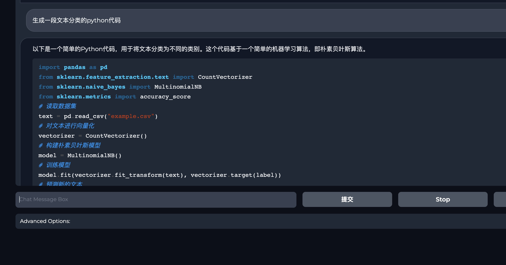
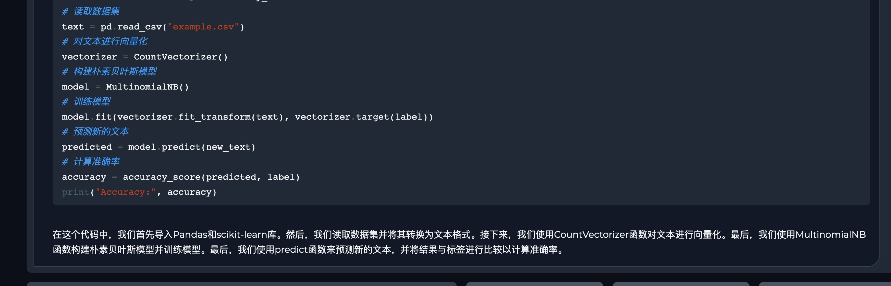

# 🚀 让人人都可以用70亿参数的大模型！（没有法律风险 可商用）
1. 🎯 在效果上，只希望比肩`chatglm-6b`
2. ⚙️ 使用`sft`数据训练中文`bloom`、`falcon`模型。
3. 🎉 提供一整套的开源解决方案。让小公司、个人都可以玩起来。可商用、无任何法务风险。

## 🔄更新记录
### [2023-06-04]日更新
1. 支持对[`falcon模型`](https://huggingface.co/tiiuae/falcon-7b)做sft～

## 📣 介绍
1. ✅ 基于[stanford_alpaca](https://github.com/tatsu-lab/stanford_alpaca)项目，使用`sft`格式数据对`bloom`、`falcon`模型微调；
2. ✅ 支持`deepspeed-zero2`、`deepspeed-zero3`；
3. ✅ 支持自定义数据，支持大数据训练；
4. ✅ 得益于`bloom`本身的能力，微调后的模型支持`中文`、`英文`、`代码`、`法语`、`西班牙语`等；
5. ✅ 微调后的模型，中文能力显著提升；
6. ✅ 支持不同尺寸`bloom`模型，如`560m`、`3b`、`7b`、`13b`； 
7. ✅ 支持`falcon`模型，如[`https://huggingface.co/tiiuae/falcon-7b`](https://huggingface.co/tiiuae/falcon-7b);


## 🥰 体验
1. 🎊 模型已经上传到huggingface上，欢迎来尝试：
- `bloom-560m_chat`: 想要体验一个轻量的，那就直接体验`5.6亿参数`[https://huggingface.co/yuanzhoulvpi/chinese_bloom_560m](https://huggingface.co/yuanzhoulvpi/chinese_bloom_560m)
- `bloom-7b_chat`: 想要体验一个更大的，那就可以试一试`70亿参数`[https://huggingface.co/yuanzhoulvpi/chinese_bloom_7b_chat](https://huggingface.co/yuanzhoulvpi/chinese_bloom_7b_chat)
2. 🎉 在hugginface上部署了一个cpu版本的（有点慢，毕竟是🆓）[https://huggingface.co/spaces/yuanzhoulvpi/chinese_bloom_560_chat](https://huggingface.co/spaces/yuanzhoulvpi/chinese_bloom_560_chat)

## 🔄 模型
1. `bloom`模型支持`中文`、`英文`、`代码`、`法语`、`西班牙语`。具体的训练数据的语言占比如下👇。


2. `bloom-3b`: [https://huggingface.co/bigscience/bloom-3b](https://huggingface.co/bigscience/bloom-3b)
3. `bloom-系列模型`: [https://huggingface.co/bigscience](https://huggingface.co/bigscience)


## 💽 数据
1. 数据来源于`BelleGroup`，主要是用到这几个数据集:`['BelleGroup/generated_chat_0.4M', 'BelleGroup/school_math_0.25M', 'BelleGroup/train_2M_CN', 'BelleGroup/train_1M_CN',
              'BelleGroup/train_0.5M_CN', 'BelleGroup/multiturn_chat_0.8M']`；
2. 可以基于这些数据样式，制作自己的数据，并训练；


## ⚙️ 步骤

### 数据部分
1. 运行`data_proj/process_data.ipynb`代码；或者模仿结果，制作自己的数据集；
2. 运行结束之后，有一个文件夹`data_proj/opendata`。文件夹下有若干个`json`格式的文件。


### 运行模型
1. 基础运行策略
```python
sh base_run.sh
```
2. `deepspeed`运行策略
```bash
sh ds_all.sh
```
## 🎯 推理代码
1. `infer.ipynb`文件
2. `gradio`交互界面：[https://huggingface.co/spaces/yuanzhoulvpi/chinese_bloom_560_chat](https://huggingface.co/spaces/yuanzhoulvpi/chinese_bloom_560_chat) 因为是使用的huggingface的免费的cpu版本，所以推理速度比较慢。

## 效果
不管是写代码还是写文案，`bloom-7b`在中文领域有极大的潜力

- example 1

- example 2

- example 3


- example 4

- example 5


## 体验
1. `chinese_bloom_560m`模型，可以在这里体验[https://huggingface.co/spaces/yuanzhoulvpi/chinese_bloom_560_chat](https://huggingface.co/spaces/yuanzhoulvpi/chinese_bloom_560_chat)
2. `chinese_bloom_7b`模型，可以在这里体验[http://101.68.79.42:7861](http://101.68.79.42:7861)