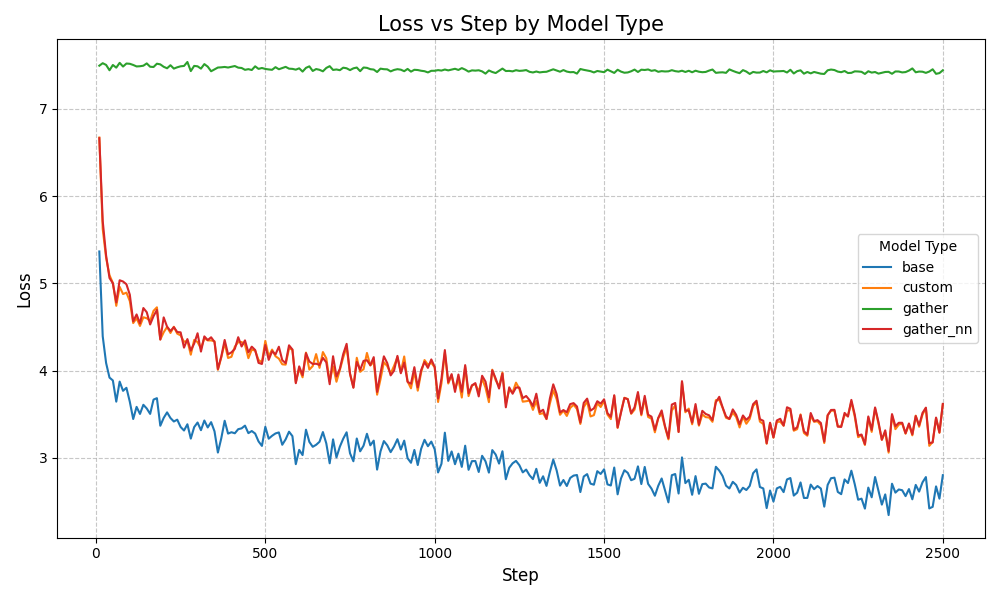
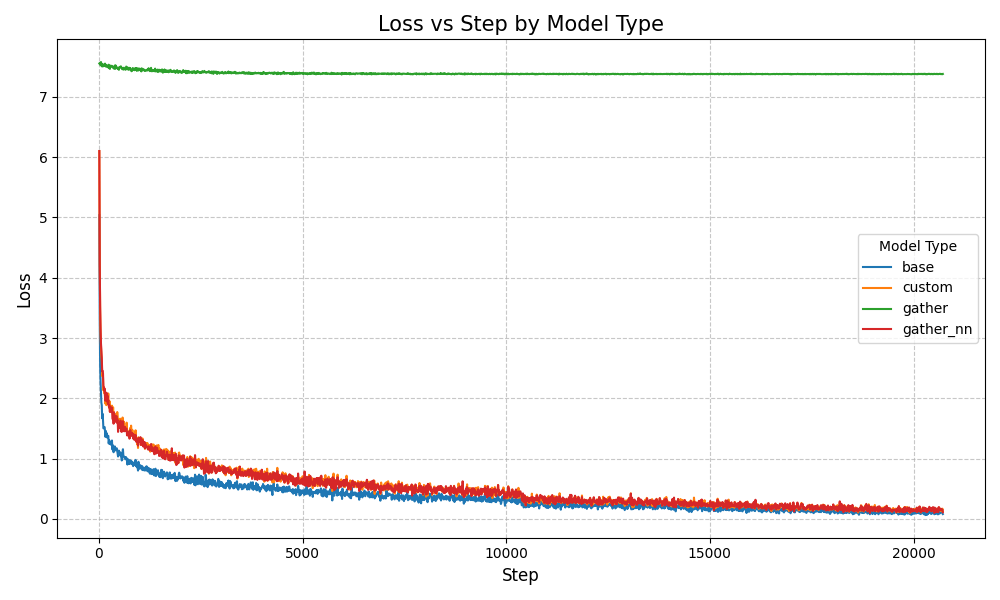

# 自定义算子实现跨卡通讯让batch更大！loss视野更广！ 基于ddp使用对比学习训练图文embedding模型（chinese-clip）

1. 关联的b站视频：[https://www.bilibili.com/video/BV1xTz1YVEmV](https://www.bilibili.com/video/BV1xTz1YVEmV) 建议结合B站视频一起使用！！

## 跨卡通讯 让batch更大
1. 直接查看代码：https://github.com/yuanzhoulvpi2017/zero_nlp/blob/main/chinese_clip_ddp/embedding/model.py#L286

## 基于vit做模型的二次开发
1. 直接查看代码：https://github.com/yuanzhoulvpi2017/zero_nlp/blob/main/chinese_clip_ddp/embedding/vit4embedding.py

## 不同的跨卡通讯方式，效果不一样的。有的是报错、有的是loss不下降

说明：
- 1. gather方法：程序报错；或者不报错、但是loss不下降。
- 2. custom方法和gather_nn方法：等价的，loss基本上都是重合的
- 3. base方法：就是正常的ddp训练，没有任何batch合并策略。

1. 使用小数据训练，loss对比

2. 使用更大的数据训练，loss对比

### 参考链接
1. clip训练方法参考这个项目[transformers/contrastive-image-text](https://github.com/huggingface/transformers/tree/66ab300aaff9ef509f8736cf186ab9b6a0ef4f3b/examples/pytorch/contrastive-image-text)
2. 跨卡通信的实现方式参考pytorch文档、chatgpt、claude等

