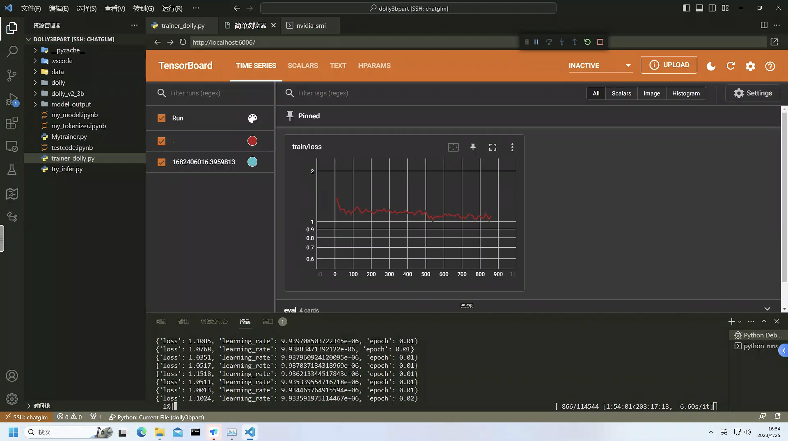

# 训练中文的`dolly_v2_3b`模型
1. [`dolly_v2_3b`](https://huggingface.co/databricks/dolly-v2-3b)模型本质上就是使用的[`gpt_neox`](https://huggingface.co/models?other=gpt_neox)模型框架，可以商用,而且也都出来很多年了。
2. 当前有很多人基于`llama`、`gptj`、`chatglm-6b`等模型，做了很多微调，有些也都做过了，有些不能商用，有些还要申请，实在是太可惜了，太麻烦了。
3. 既然`dolly_v2_3b`可以商用，那我们就主打一个随意，稍微动动手就可以训练一个属于我们的模型。
4. 本仓库用到的代码，来源于[`databrickslabs/dolly`](https://github.com/databrickslabs/dolly#getting-started-with-response-generation)，对代码做了部分调整和融合。反正就是`复制粘贴`、`懂得都懂`～
5. 模型叫什么名字：`小黑子` 😛

# 做了什么
1. 🎯 支持多卡模型并行：也不知道`databrickslabs/dolly`为啥要使用`gpt_neox`模型，这个模型`transformers`对他支持的其实一般，于是我把代码魔改了一部分，增加了多卡并行计算功能(主要是是`模型并行`).
2. 🥱 虽然代码是从[`databrickslabs/dolly`](https://github.com/databrickslabs/dolly#getting-started-with-response-generation)复制的，但是简化了很多不必要的代码，更简单一点，我不喜欢复杂的代码，越简单越好。
3. 😵 支持`bp16`：我原本的打算是说支持`fp16`的，但是发现`fp16`怎么搞都不行，但是`bp16`倒是可以。
# 下一步优化方向
2. 😆 添加`lora`等微调训练代码，这个简单，等后面都训练好了，我添加一下。

# 模型啥时候放出来
## 目前模型还在训练：
1. 训练数据：[`BelleGroup/train_1M_CN`](https://huggingface.co/datasets/BelleGroup/train_1M_CN)
2. 训练时间：280小时左右
3. 训练设备：`4台3090`

