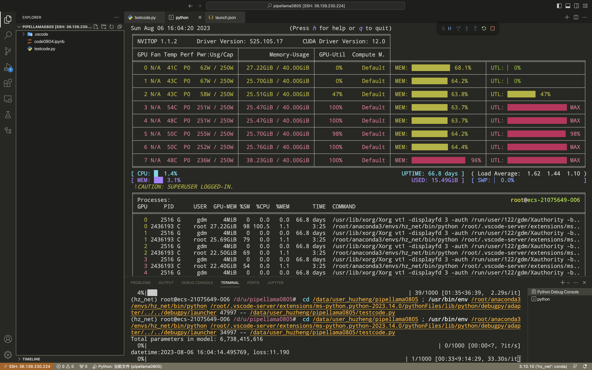

# pipeline for llama (流水线并行)

### 传统的模型并行👉

### 流水线并行👉

## 我的工作

基于pytorch提供的[PIPELINE PARALLELISM](https://pytorch.org/docs/stable/pipeline.html)
功能，参考了transformer包提供的`llama`的代码后，给llama架构实现了一套流水线并行训练代码。

### 整体的gpu负载如下：
