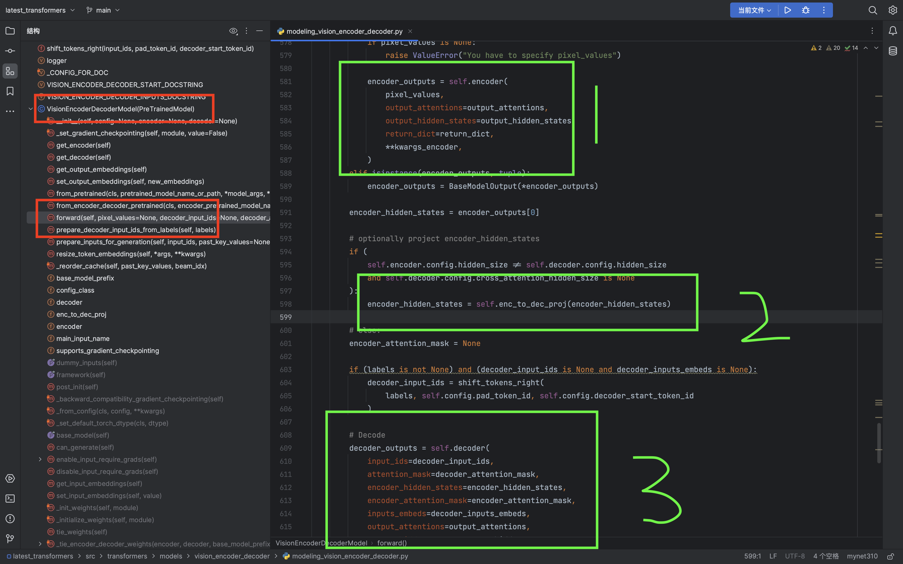
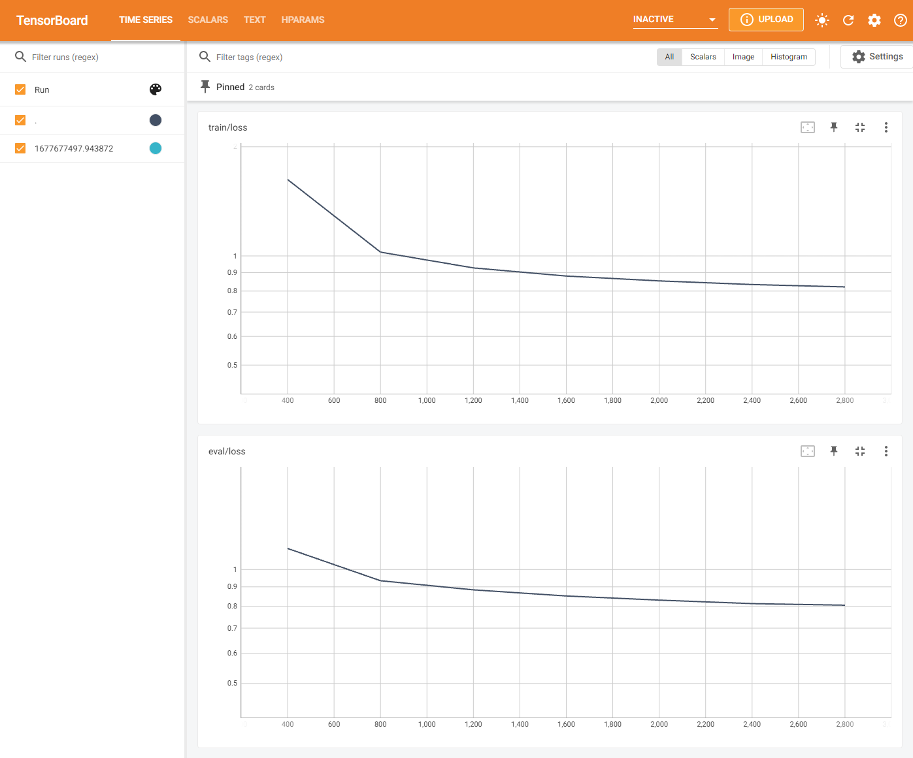
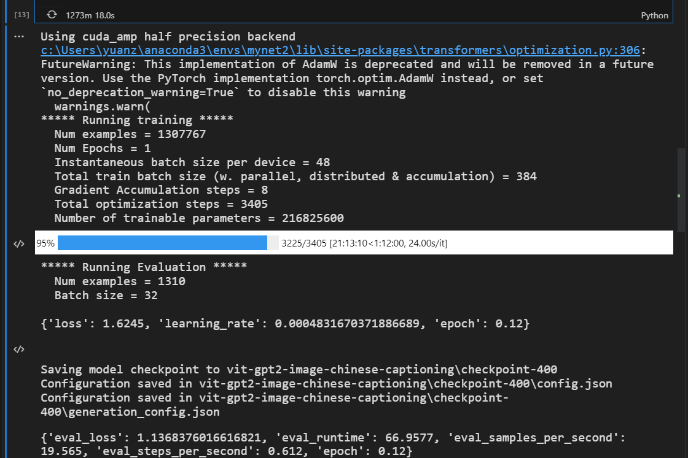

# 介绍
## image-encoder-decoder


之前在huggingface[https://huggingface.co/nlpconnect/vit-gpt2-image-captioning](https://huggingface.co/nlpconnect/vit-gpt2-image-captioning)上看到这个模型.

1. 感觉这个模型很有趣，想法很好。
2. 发现这个模型关于中文的不多。
3. 之前的`clip`训练其实挺失败的，`loss`没有下降.

主要也就是抱着学习的态度，把源码看懂，把流程跑通。分享中间的细节和踩坑经历。

## 源码介绍

能想出来还是非常厉害的(直呼胶水怪！！)，目前从源码上看，大概是这么一回事:

1. 使用`vit`来作为`encoder`部分，输出`encoder_hidden_states`，`绿色部分1`。
2. 使用`gpt2`来作为`decoder`部分,接受`encoder_hidden_states`,`绿色部分3`。
3. 如果`encoder`输出的`encoder_hidden_states`和`decoder`接受的`encoder_hidden_states`维度不一样，就加个`linear`,`绿色部分2`。

## 模型训练需要的数据样式
训练的时候，模型需要的数据主要有两个维度：
1. `pixel_value`：`image`通过`processor`生成
2. `label`：`text`通过`tokenizer`生成的`input_ids`。
3. 计算`loss`的时候，其实和`gpt2`一模一样的（自回归，本质上就是向后错位一下）。


# huggingface🤗

目前已经把我训练好的模型，发布在`huggingface`上了。[https://huggingface.co/yuanzhoulvpi/vit-gpt2-image-chinese-captioning](https://huggingface.co/yuanzhoulvpi/vit-gpt2-image-chinese-captioning)


# 训练
## 数据部分
本模块处理数据的方式和`clip`模型差不多，可以看隔壁文件夹，训练`clip`的数据处理思路。
### 注意⚠️
1. 只要把`processdta_02.ipynb`文件替换即可。
2. 执行顺序依然按照着`processdta_01.ipynb`、`processdta_02.ipynb`、`processdta_03.ipynb`。

## 训练部分`train_encoder_decoder.ipynb`
1. 处理图像，使用的是`"google/vit-base-patch16-224"`模型。
2. 处理文本，使用的是`"yuanzhoulvpi/gpt2_chinese"`模型。
3. 最后就是把两个模型通过`VisionEncoderDecoderModel`粘起来。

## 训练的loss


## 训练的信息
gpu使用的是3090，模型大概是2.16亿个参数。花了超过20个小时。但是大部分时间都是卡在IO上（加载图片上）



# 推理
## 用你自己训练
参考`infer_encoder_decoder.ipynb`

## 直接用
```python
from transformers import (VisionEncoderDecoderModel, 
                          AutoTokenizer,ViTImageProcessor)
import torch
from PIL import Image
```
```python
vision_encoder_decoder_model_name_or_path = "yuanzhoulvpi/vit-gpt2-image-chinese-captioning"#"vit-gpt2-image-chinese-captioning/checkpoint-3200"

processor = ViTImageProcessor.from_pretrained(vision_encoder_decoder_model_name_or_path)
tokenizer = AutoTokenizer.from_pretrained(vision_encoder_decoder_model_name_or_path)
model = VisionEncoderDecoderModel.from_pretrained(vision_encoder_decoder_model_name_or_path)
device = torch.device("cuda" if torch.cuda.is_available() else "cpu")
model.to(device)

```
```python
max_length = 16
num_beams = 4
gen_kwargs = {"max_length": max_length, "num_beams": num_beams}


def predict_step(image_paths):
    images = []
    for image_path in image_paths:
        i_image = Image.open(image_path)
        if i_image.mode != "RGB":
            i_image = i_image.convert(mode="RGB")

        images.append(i_image)

    pixel_values = processor(images=images, return_tensors="pt").pixel_values
    pixel_values = pixel_values.to(device)

    output_ids = model.generate(pixel_values, **gen_kwargs)

    preds = tokenizer.batch_decode(output_ids, skip_special_tokens=True)
    preds = [pred.strip() for pred in preds]
    return preds


predict_step(['bigdata/image_data/train-1000200.jpg'])

```


